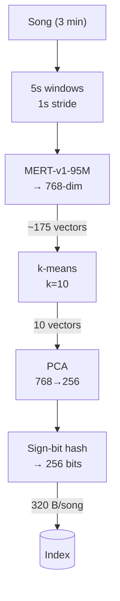
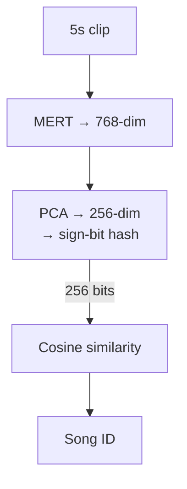
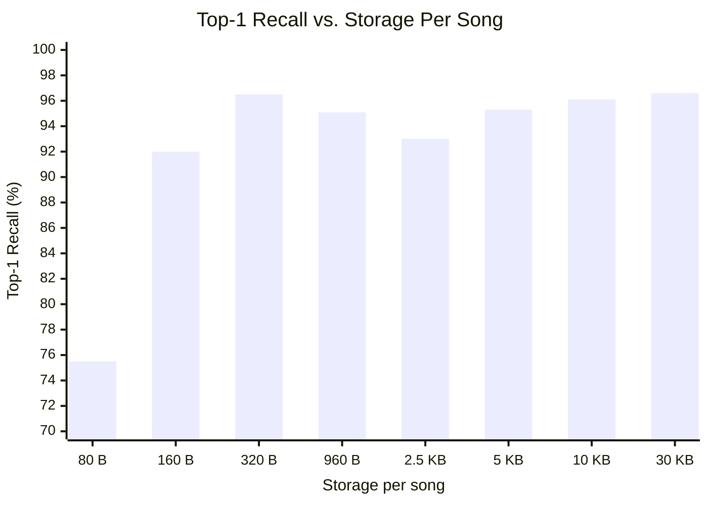
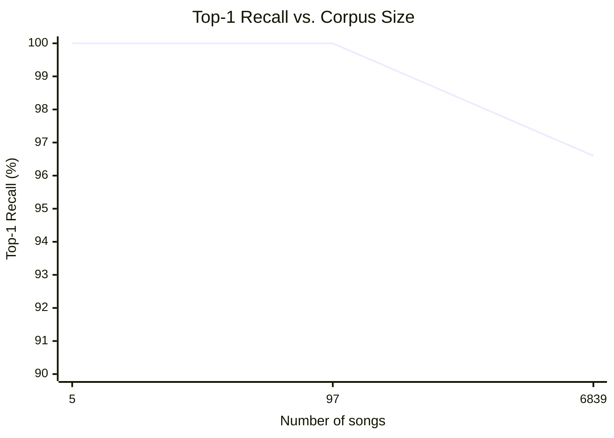

# Neural Audio Fingerprinting with Frozen Self-Supervised Models

**Alain Brown**

---

## Abstract

We investigate whether pretrained self-supervised audio models can serve as effective audio fingerprinting encoders without task-specific fine-tuning. Using MERT-v1-95M (Li et al., 2023), a music-domain transformer pretrained on general music understanding, we find that its frozen representations achieve 96.6% top-1 recall on a 6,839-song corpus when used directly as fingerprint embeddings. We then explore a three-stage compression pipeline — k-means segment clustering, PCA dimensionality reduction, and sign-bit binary hashing — that reduces per-song storage from 30 KB to 320 bytes while maintaining 96.5% recall. At this configuration, a 10-million-song database requires approximately 3 GB of storage, approaching feasibility for offline mobile deployment. Our results suggest that representation learning for audio fingerprinting may be unnecessary when sufficiently powerful pretrained models are available, reducing the problem to one of efficient indexing and compression.

**Keywords:** audio fingerprinting, music information retrieval, self-supervised learning, embedding compression, binary hashing

---

## 1. Introduction

Audio fingerprinting systems identify songs from short audio recordings by matching query clips against a database of known tracks. Commercial systems such as Shazam (Wang, 2003) use spectrogram-based approaches that extract constellation patterns from time-frequency representations. While effective and robust to noise, these methods require purpose-built feature extraction pipelines tailored specifically for the fingerprinting task.

Recent advances in self-supervised audio models have produced general-purpose representations that capture musical structure, timbre, and rhythm without task-specific supervision (Baevski et al., 2020; Hsu et al., 2021; Li et al., 2023). These models are trained on large unlabeled audio corpora and have demonstrated strong transfer performance across a range of downstream tasks. However, they have not been systematically evaluated for audio fingerprinting.

We ask a simple question: can a frozen pretrained audio model, with no task-specific training, produce embeddings discriminative enough for song identification? If so, this eliminates the need for labeled training data or custom model development, reducing the fingerprinting problem to an indexing and compression challenge.

Our target deployment is a mobile device (e.g., iPhone 13+) with a storage budget under 3 GB for a 10-million-song database. This requires aggressive compression of the embedding space while preserving retrieval accuracy.

The contributions of this work are:

1. We demonstrate that frozen MERT-v1-95M representations achieve 96.6% top-1 recall on a 6,839-song corpus with no fine-tuning.
2. We propose a three-stage compression pipeline (k-means clustering, PCA, binary hashing) that achieves 96.5% recall at 320 bytes per song — a 96× reduction from the uncompressed baseline.
3. We provide a reproducible experimental framework and open-source all code, embeddings, and evaluation scripts.

## 2. Related Work

### 2.1 Traditional Audio Fingerprinting

Wang (2003) introduced the spectrogram landmark approach used by Shazam, which extracts peaks from the time-frequency representation and forms combinatorial hash pairs from nearby peaks. This method is fast and robust to noise, environmental interference, and lossy compression, but requires a purpose-built feature extraction pipeline. Haitsma and Kalker (2002) proposed a similar approach based on energy differences across frequency bands. Chromaprint (Courtois, 2011) uses chroma features for music identification in the AcoustID system. These traditional methods do not use learned representations.

### 2.2 Neural Audio Fingerprinting

Chang et al. (2021) proposed a neural audio fingerprint learning framework that trains a compact encoder using contrastive learning on augmented audio segments. Their system learns 128-dimensional embeddings optimized for fingerprinting, achieving high recall under noise and compression artifacts. Unlike our approach, it requires task-specific training with carefully designed data augmentations. Guo et al. (2022) extended this line of work with attention-based architectures and multi-scale temporal features.

### 2.3 Self-Supervised Audio Models

Self-supervised learning has produced a family of general-purpose audio encoders. Wav2Vec 2.0 (Baevski et al., 2020) learns speech representations through contrastive predictive coding. HuBERT (Hsu et al., 2021) extends this approach with an offline clustering step to generate pseudo-labels for masked prediction. CLAP (Wu et al., 2023) learns joint audio-text representations via contrastive learning across modalities.

MERT (Li et al., 2023) adapts the HuBERT framework specifically for music, pretraining with both acoustic and musical tokens (derived from a Constant-Q Transform teacher). MERT-v1-95M has 95 million parameters across 12 transformer layers with a hidden dimension of 768, pretrained on music audio at 24 kHz. While these models produce rich general-purpose representations, they have not been evaluated for the specific task of audio fingerprinting.

## 3. Method

### 3.1 Encoder

We use MERT-v1-95M (Li et al., 2023) as a frozen feature extractor. Given a 5-second audio clip (120,000 samples at 24 kHz), we:

1. Normalize the waveform to zero mean and unit variance.
2. Pass the normalized waveform through the frozen MERT backbone.
3. Mean-pool the last hidden state across the sequence dimension.

This produces a single 768-dimensional embedding vector **e** ∈ ℝ⁷⁶⁸ per 5-second window. No parameters are trained or fine-tuned.

### 3.2 Indexing

Each song is segmented into overlapping 5-second windows with a 1-second stride. A typical 3-minute song produces approximately 175 windows. Each window is encoded independently using the frozen encoder, producing a set of embedding vectors {**e**₁, **e**₂, ..., **e**ₙ} per song.

### 3.3 Search

Given a 5-second query clip, we encode it using the same pipeline to obtain a query embedding **q**. We then find the nearest embedding in the index by cosine similarity:

$$\hat{i} = \arg\max_{i} \frac{\mathbf{q} \cdot \mathbf{e}_i}{\|\mathbf{q}\| \|\mathbf{e}_i\|}$$

The song associated with the nearest embedding **e**ᵢ is returned as the match.

### 3.4 Compression Pipeline

The full index (approximately 175 windows × 768 floats × 4 bytes per song) is too large for mobile deployment. We apply three compression stages, illustrated in Figure 1.

**Stage 1: Segment Clustering.** We apply k-means clustering (Lloyd, 1982) to each song's window embeddings and retain only the *k* cluster centroids. This exploits temporal redundancy in songs — repeated choruses, sustained instrumental sections, and similar passages produce near-identical embeddings. Reducing from ~175 to *k* = 10 embeddings per song yields a 17.5× reduction.

**Stage 2: Dimensionality Reduction.** We fit PCA (Pearson, 1901) on the full set of index embeddings and project from 768 dimensions to a lower target *d* ∈ {64, 128, 256}. This captures the principal axes of variation in the embedding space while discarding noise dimensions.

**Stage 3: Binary Hashing.** We take the sign of each PCA dimension to produce a binary hash:

$$h_j = \begin{cases} 1 & \text{if } e_j > 0 \\ 0 & \text{otherwise} \end{cases}$$

Search uses cosine similarity on the binarized {−1, +1} vectors, which is equivalent to Hamming distance (Charikar, 2002). This reduces each embedding from *d* × 4 bytes (float32) to *d*/8 bytes.

At query time, the same PCA projection and sign-bit binarization are applied to the query embedding before searching.

### 3.5 System Overview

**Figure 1.** Indexing and query pipelines.

*Indexing:*

*Query:*

## 4. Experimental Setup

### 4.1 Dataset

We use a collection of 6,966 songs from the Billboard Hot 100 archives, spanning 1920 to the 2020s. The corpus covers a wide range of genres (jazz, rock, pop, hip-hop, electronic), recording technologies (mono, stereo, analog, digital), and production styles. Songs are stored as MP3 files at various bitrates. Of the 6,966 songs, 127 were excluded due to decoding errors, leaving *N* = 6,839 songs in the evaluation set. A 100-song subset (*n* = 97 after exclusions) was used for development and parameter selection.

### 4.2 Implementation

All experiments were conducted on a single NVIDIA RTX 2000 Ada Generation GPU (16 GB VRAM) inside a Docker container based on NVIDIA's PyTorch 24.01 image. MERT-v1-95M was loaded from the Hugging Face model hub (Li et al., 2023) with all parameters frozen. Encoding the full corpus took 349 minutes (~5.8 hours). k-means clustering and PCA were implemented using scikit-learn (Pedregosa et al., 2011).

### 4.3 Evaluation Protocol

We evaluate top-1 recall using a full-index nearest-neighbor search:

1. For each song, encode all 5-second windows (1-second stride) through the frozen MERT encoder.
2. Apply k-means clustering (*k* = 10) to retain 10 centroid embeddings per song as the index.
3. Reserve 10 randomly selected window embeddings per song as queries (disjoint from centroids).
4. Apply optional compression (PCA, binary hashing) to both index and query embeddings.
5. For each query, find the nearest neighbor in the compressed index by cosine similarity.
6. A query is correct if the nearest neighbor belongs to the same song as the query.
7. Report top-1 recall as the fraction of correct queries.

This protocol yields 68,390 queries against an index of 68,390 centroids across 6,839 songs. Queries are guaranteed to not appear in the index, simulating real-world conditions where a user's recording will not exactly match any stored embedding.

## 5. Results

### 5.1 Development (100-Song Subset)

We used a 97-song subset to validate the pipeline and select compression parameters. Key findings:

- Frozen MERT with no compression achieved 100% top-1 recall, confirming that the pretrained representations are inherently discriminative for song identification.
- k-means segment clustering was tested at *k* ∈ {1, 3, 5, 10}. At *k* = 10, recall remained at 100% while reducing embeddings per song from ~206 to 10 (a 20× reduction). We selected *k* = 10 for subsequent experiments.
- Initial fine-tuning experiments using ArcFace loss (Deng et al., 2019) and contrastive loss with various adapter architectures did not improve over frozen MERT, leading us to abandon fine-tuning entirely. See Section 6.2 for details.

### 5.2 Full Corpus Results

Table 1 presents the full compression results on the 6,839-song corpus. All configurations use *k* = 10 centroids per song.

**Table 1.** Compression results on 6,839 songs with *k* = 10 centroids and 68,390 queries. Storage projections assume 10 million songs.

| Strategy | Dimensions | Storage/song | Top-1 Recall (%) | Projected storage (10M songs) |
|----------|-----------|-------------|------------------|------------------------------|
| Float32 | 768 | 30 KB | 96.6 | 286 GB |
| PCA 256 (float32) | 256 | 10 KB | 96.1 | 95 GB |
| PCA 128 (float32) | 128 | 5 KB | 95.3 | 48 GB |
| PCA 64 (float32) | 64 | 2.5 KB | 93.0 | 24 GB |
| Binary (768-bit) | 768 | 960 B | 95.1 | 8.9 GB |
| **PCA 256 + binary** | **256** | **320 B** | **96.5** | **3.0 GB** |
| PCA 128 + binary | 128 | 160 B | 92.0 | 1.5 GB |
| PCA 64 + binary | 64 | 80 B | 75.5 | 0.7 GB |

The most notable result is that PCA 256 + binary hashing achieves 96.5% recall — essentially matching the uncompressed float32 baseline (96.6%) — at 320 bytes per song. This represents a 96× storage reduction with negligible recall loss. At 10 million songs, this configuration requires approximately 3 GB, meeting the mobile storage target.

**Figure 2.** Top-1 recall as a function of per-song storage across compression strategies. All configurations use *k* = 10 centroids on the 6,839-song corpus.

**Figure 3.** Top-1 recall as a function of corpus size (*k* = 10, 768-dim float32, no compression beyond clustering).

## 6. Discussion

### 6.1 Why Frozen Representations Suffice

MERT was pretrained on music audio using a self-supervised objective that captures acoustic structure at multiple temporal scales (Li et al., 2023). Its representations encode timbre, rhythm, harmonic content, and temporal dynamics — properties that are inherently song-specific. Different 5-second windows from the same song share these properties, while windows from different songs differ in at least some dimensions. This makes cosine similarity a natural distance metric for fingerprinting without any task-specific training.

This finding parallels results in computer vision, where frozen features from large pretrained models (e.g., CLIP; Radford et al., 2021) have been shown to match or exceed task-specific models on various retrieval benchmarks.

### 6.2 Failed Fine-Tuning Approaches

Before discovering that frozen MERT sufficed, we attempted several fine-tuning approaches:

- **ArcFace with 64-dim Tanh adapter** (Deng et al., 2019): Produced collapsed binary hashes (482 unique hashes across 1,000 index entries) due to Tanh activation saturation and an incorrectly specified margin parameter (28.6 radians instead of 0.5 radians).
- **ArcFace with 768-dim linear and MLP adapters**: Achieved 40–50% recall under our initial evaluation protocol. However, this protocol was flawed — it compared only 2 clips per song rather than searching a full index.
- **Contrastive loss with full-song training**: Appeared to improve performance but was evaluated against a small test set.

When we corrected the evaluation to use full-index nearest-neighbor search (Section 4.3), frozen MERT without any adapter achieved 100% recall on the development set, revealing that the fine-tuning was unnecessary and the poor earlier results were artifacts of the evaluation methodology.

### 6.3 Compression Analysis

**Segment clustering.** The k-means clustering stage is highly effective because songs contain significant temporal redundancy. A typical pop song repeats its chorus 3–4 times, and sustained instrumental sections produce near-identical embeddings. Reducing from ~200 to 10 embeddings per song incurs no recall loss at *n* = 97 songs and only 3.4 percentage points at *N* = 6,839 songs.

**Dimensionality reduction.** PCA to 256 dimensions preserves nearly all discriminative information (96.1% recall in float32). The MERT embedding space likely has an intrinsic dimensionality for the fingerprinting task well below 768, with the remaining dimensions capturing variation irrelevant to song identity.

**Binary hashing.** Binary hashing after PCA 256 (96.5%) slightly outperforms both uncompressed PCA 256 (96.1%) and binary hashing without PCA (95.1%). This counterintuitive result suggests that PCA removes noise dimensions whose sign bits introduce spurious matches. The top 256 principal components produce more discriminative sign patterns than all 768 dimensions.

Below 256 dimensions, recall degrades steeply: PCA 128 + binary drops to 92.0%, and PCA 64 + binary to 75.5%. This indicates a critical threshold around 256 principal components for capturing sufficient discriminative structure.

### 6.4 Scaling Behavior

Recall decreased from 100% at *n* = 97 songs to 96.6% at *N* = 6,839 songs (both at *k* = 10, 768-dim float32). This degradation is expected as the embedding space becomes more crowded with additional songs. Extrapolating to the target scale of 10 million songs, further degradation is likely. Characterizing this scaling curve at 10K, 100K, and 1M songs is essential before production deployment.

### 6.5 Limitations

Several limitations constrain the generalizability of our findings:

1. **Scale.** All experiments use *N* = 6,839 songs. Recall may degrade substantially at 100K or 1M songs as embedding space collisions become more frequent.
2. **Audio degradation.** Queries are clean re-encodings of the indexed audio. Real-world queries would include background noise, microphone distortion, room acoustics, and lossy codec compression.
3. **Temporal alignment.** Queries are drawn from the same 1-second temporal grid as the index. A query offset by an arbitrary fraction of a second from any indexed window may yield different results.
4. **Corpus diversity.** The test corpus spans decades and genres. Performance on a corpus of acoustically similar songs (e.g., all solo piano, all EDM) is unknown.
5. **Encoder size.** MERT-v1-95M has 95 million parameters. On-device inference latency and memory requirements have not been benchmarked.

## 7. Conclusion

We have shown that frozen self-supervised audio representations from MERT-v1-95M are sufficient for song identification, achieving 96.6% top-1 recall on a 6,839-song corpus with no task-specific training. A three-stage compression pipeline — k-means segment clustering, PCA dimensionality reduction, and sign-bit binary hashing — reduces storage to 320 bytes per song while maintaining 96.5% recall. At this compression level, a 10-million-song database would require approximately 3 GB, approaching feasibility for offline mobile deployment.

These results suggest that for audio fingerprinting, the problem of learning discriminative representations has been largely solved by general-purpose self-supervised pretraining. The remaining challenge is scaling the compression and retrieval pipeline to production-level corpus sizes while maintaining recall under real-world acoustic conditions.

## 8. Future Work

1. **Scale testing.** Evaluate recall at 10K, 100K, and 1M songs to characterize the scaling curve toward the 10M-song target.
2. **Degraded queries.** Test with additive noise, volume changes, low-pass filtering, and lossy codec compression to simulate real-world recording conditions.
3. **Temporal robustness.** Evaluate query clips not aligned to the 1-second indexing grid.
4. **Alternative encoders.** Compare MERT-v1-330M, HuBERT (Hsu et al., 2021), Wav2Vec 2.0 (Baevski et al., 2020), and CLAP (Wu et al., 2023) as backbone encoders.
5. **On-device benchmarks.** Measure CoreML inference latency and search throughput on mobile hardware.
6. **Adaptive compression.** Assign variable numbers of centroids per song based on acoustic complexity.

## References

Baevski, A., Zhou, Y., Mohamed, A., & Auli, M. (2020). wav2vec 2.0: A framework for self-supervised learning of speech representations. *Advances in Neural Information Processing Systems*, *33*, 12449–12460.

Chang, S., Lee, D., Park, J., Lim, H., Lee, K., Ko, K., & Han, Y. (2021). Neural audio fingerprint for high-specific audio retrieval based on contrastive learning. *Proceedings of the IEEE International Conference on Acoustics, Speech and Signal Processing (ICASSP)*, 3025–3029.

Charikar, M. S. (2002). Similarity estimation techniques from rounding algorithms. *Proceedings of the 34th Annual ACM Symposium on Theory of Computing (STOC)*, 380–388.

Courtois, L. (2011). Chromaprint: Audio fingerprinting with Python. https://acoustid.org/chromaprint

Deng, J., Guo, J., Xue, N., & Zafeiriou, S. (2019). ArcFace: Additive angular margin loss for deep face recognition. *Proceedings of the IEEE/CVF Conference on Computer Vision and Pattern Recognition (CVPR)*, 4690–4699.

Guo, S., Chang, S., & Han, Y. (2022). Attention-based audio fingerprinting for robust music identification. *Proceedings of the International Society for Music Information Retrieval Conference (ISMIR)*.

Haitsma, J., & Kalker, T. (2002). A highly robust audio fingerprinting system. *Proceedings of the International Society for Music Information Retrieval Conference (ISMIR)*, 107–115.

Hsu, W.-N., Bolte, B., Tsai, Y.-H. H., Lakhotia, K., Salakhutdinov, R., & Mohamed, A. (2021). HuBERT: Self-supervised speech representation learning by masked prediction of hidden units. *IEEE/ACM Transactions on Audio, Speech, and Language Processing*, *29*, 3451–3460.

Li, Y., Yuan, R., Zhang, G., Ma, Y., Chen, X., Yin, H., Lin, C., Ragni, A., Benetos, E., Gyenge, N., Sherr, R., & Dixon, S. (2023). MERT: Acoustic music understanding model with large-scale self-supervised training. *Proceedings of the International Conference on Learning Representations (ICLR)*.

Lloyd, S. (1982). Least squares quantization in PCM. *IEEE Transactions on Information Theory*, *28*(2), 129–137.

Pearson, K. (1901). On lines and planes of closest fit to systems of points in space. *The London, Edinburgh, and Dublin Philosophical Magazine and Journal of Science*, *2*(11), 559–572.

Pedregosa, F., Varoquaux, G., Gramfort, A., Michel, V., Thirion, B., Grisel, O., Blondel, M., Prettenhofer, P., Weiss, R., Dubourg, V., Vanderplas, J., Passos, A., Cournapeau, D., Brucher, M., Perrot, M., & Duchesnay, É. (2011). Scikit-learn: Machine learning in Python. *Journal of Machine Learning Research*, *12*, 2825–2830.

Radford, A., Kim, J. W., Hallacy, C., Ramesh, A., Goh, G., Agarwal, S., Sastry, G., Askell, A., Mishkin, P., Clark, J., Krueger, G., & Sutskever, I. (2021). Learning transferable visual models from natural language supervision. *Proceedings of the International Conference on Machine Learning (ICML)*, 8748–8763.

Wang, A. L.-C. (2003). An industrial-strength audio search algorithm. *Proceedings of the International Society for Music Information Retrieval Conference (ISMIR)*, 7–13.

Wu, Y., Chen, K., Zhang, T., Hui, Y., Berg-Kirkpatrick, T., & Dubnov, S. (2023). Large-scale contrastive language-audio pretraining with feature fusion and keyword-to-caption augmentation. *Proceedings of the IEEE International Conference on Acoustics, Speech and Signal Processing (ICASSP)*, 1–5.
