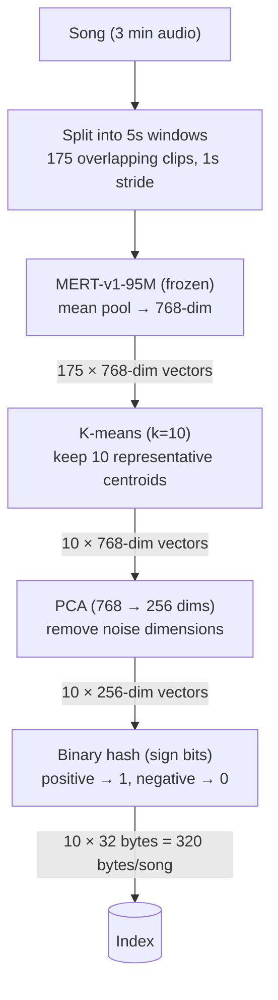
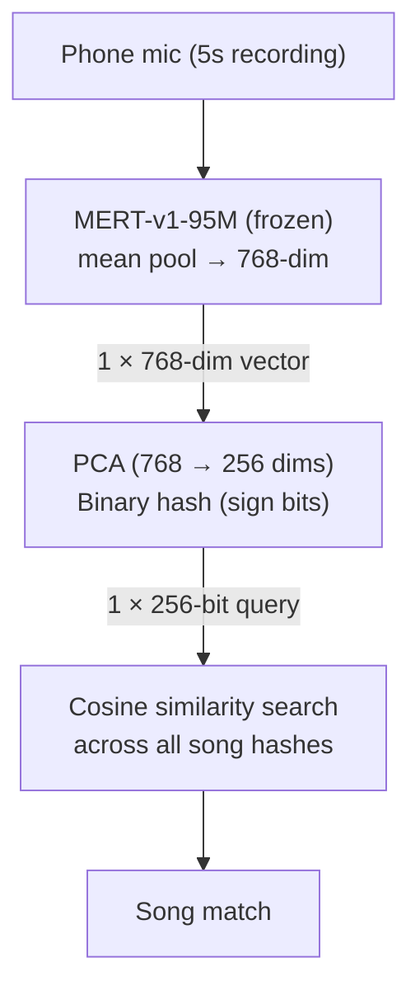

# MusicPrint

> Offline music recognition on a phone. 10 million songs, under 3GB, no server.

MusicPrint is an experiment to see if a complete Shazam-like system can run entirely on a mobile device. The key finding: a frozen pretrained audio model (MERT-v1-95M) produces embeddings discriminative enough for song identification with no fine-tuning. Combined with k-means clustering, PCA, and binary hashing, the index compresses to 320 bytes per song — 3 GB for 10 million songs. For comparison, spectrogram-based approaches like Shazam typically require 8–24 KB per song, a 25-75x savings.

[**Try the demo**](https://huggingface.co/spaces/alainbrown/musicprint) · [Paper](PAPER.md) · [Dataset](https://huggingface.co/datasets/alainbrown/musicprint-embeddings)

## Results

On a corpus of 6,839 songs (Billboard Hot 100, 1920–2020s):

| Config | Storage/song | Recall | @ 10M songs |
|--------|-------------|--------|-------------|
| Frozen MERT, k=10 centroids, float32 | 30 KB | 96.6% | 286 GB |
| + PCA 256 + binary hashing | 320 B | 96.5% | 3.0 GB |
| + PCA 128 + binary hashing | 160 B | 92.0% | 1.5 GB |

## How It Works

### Indexing a song



### Searching for a song



## Running the Experiments

Requires Docker and an NVIDIA GPU.

**1. Build the pipeline image**
```bash
docker compose build training
```

**2. Run experiments interactively**
```bash
docker compose up training
# Open http://localhost:8888 (token: musicprint)
# Open experiments.py as a notebook (jupytext format)
```

**3. Or run experiments as a script**
```bash
docker compose run --rm training python experiments.py
```

The first run encodes all songs through MERT (~6 hours on RTX 2000 Ada) and caches results to disk. Subsequent runs load the cache and run compression experiments in seconds.

Audio files go in `music/` (MP3, FLAC, or WAV in any subdirectory structure).

## Repository Structure

```
experiments.py          # Reproducible experiments notebook (jupytext)
PAPER.md                # Research paper
docker/
  Dockerfile.pipeline   # GPU image (MERT, PyTorch, torchaudio)
docker-compose.yml      # All services
1_adapter_training/     # Encoder training pipeline (experimental)
2_vector_index/         # Binary index builder
3_meta_tokenizer/       # BPE metadata compression
4_album_art/            # VQ-VAE album art compression
libmusicprint/          # C++ search library (for iOS deployment)
```

## License

MIT
